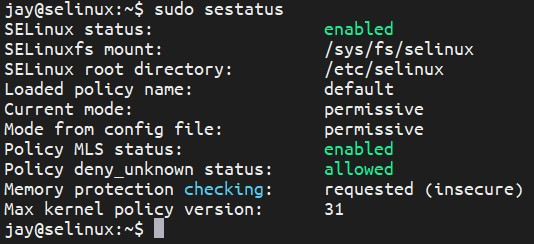
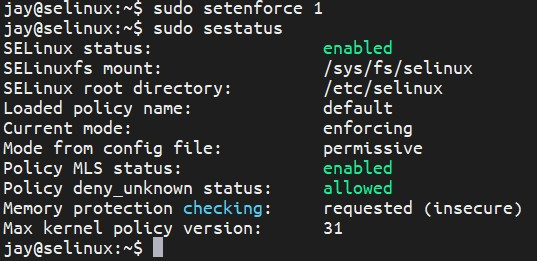

NS Mini Project 5
===

## Environment
- Ubuntu 18.04

## Install SELinux on Ubuntu
### Step 1 - Update the system
```bash
sudo apt update
```

### Step 2 - Remove AppArmor
#### Stop AppArmor using systemctl
```bash
sudo systemctl stop apparmor
```

#### Purge AppArmor
```bash
sudo apt purge apparmor
```

#### Update the system
```bash
sudo apt update && sudo apt upgrade -yuf
```

#### Reboot
```bash
sudo reboot
```

### Step 3 - Install SELinux
#### Install the SELinux package along with supporting packages
```bash
sudo apt install selinux selinux-utils selinux-basics auditd audispd-plugins
```

#### Verify the lnstallation
```bash
sudo sestatus
```
The status of SELinux should be `disabled` at this step

#### Reboot
```bash
sudo reboot
```

#### Log back to your machine via ssh
```bash
ssh username@ip_addr
```

#### Verify the status of SELinux
```bash
sudo sestatus
```
The output should be similar to the follow figure



#### Enforce SELinux
```bash
sudo setenforce 1
```
After enforcing SELinux, `sudo sestatus` will output which is the similar to the following figure



## Write the rule for the SPEC
